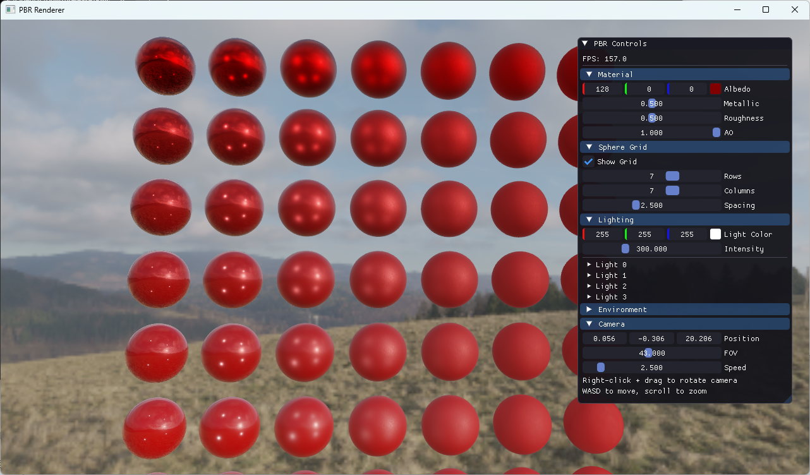

# PBR Renderer

A Physically Based Rendering (PBR) demo built with OpenGL 3.3, ImGui, and Image-Based Lighting (IBL), following the [LearnOpenGL PBR tutorial](https://learnopengl.com/PBR/Theory).
* [Example Forge Mod for Minecraft 1.7.10](#example-forge-mod-for-minecraft-1710)
    * [Motivation](#motivation)
    * [Help! I'm stuck!](#help-im-stuck)
    * [Getting started](#getting-started)
    * [Features](#features)
    * [Files](#files)
    * [Forge's Access Transformers](#forges-access-transformers)
    * [Mixins](#mixins)
    * [Advanced](#advanced)
    * [Feedback wanted](#feedback-wanted)


## Features

- **PBR Shading**: Cook-Torrance BRDF with GGX distribution, Smith geometry, and Fresnel-Schlick
- **Image-Based Lighting**: Diffuse irradiance + specular IBL with split-sum approximation
- **HDR Environment Maps**: Equirectangular-to-cubemap conversion, irradiance convolution, pre-filtered environment maps, BRDF LUT
- **JSON Scene Config**: All scene parameters (camera, lights, material, HDR path, grid) driven by `scene.json`, no hardcoded values
- **Dynamic HDR Switching**: Scan directory for `.hdr`/`.exr` files, select and reload at runtime via ImGui
- **ImGui Controls**: Real-time material editing, light configuration, camera parameters, config save/load
- **Sphere Grid**: Visualize PBR response across metallic/roughness parameter space

## Dependencies

Managed via **vcpkg** (submodule) and **git submodules**:

| Dependency | Source | Purpose |
|-----------|--------|---------|
| GLFW | vcpkg | Window/context management |
| GLM | vcpkg | Math library |
| Assimp | vcpkg | Model loading |
| nlohmann-json | vcpkg | JSON config parsing |
| glad | thirdparty/ (pre-generated) | OpenGL loader |
| stb | submodule | Image loading (HDR/LDR) |
| Dear ImGui | submodule | UI framework |

## Build Instructions

### Prerequisites

- CMake 3.20+
- C++17 compiler (MSVC 2019+, GCC 9+, Clang 10+)
- Git

### Clone

```bash
git clone --recursive <repository-url>
cd target
```

If you already cloned without `--recursive`:

```bash
git submodule update --init --recursive
```

### Bootstrap vcpkg

**Windows:**

```cmd
vcpkg\bootstrap-vcpkg.bat
```

**Linux/macOS:**

```bash
./vcpkg/bootstrap-vcpkg.sh
```

### Configure & Build

```bash
cmake -B build -S .
cmake --build build --config Release
```

Or with a specific generator:

```bash
cmake -B build -S . -G "Visual Studio 17 2022"
cmake --build build --config Release
```

### Run

```bash
cd build/Release
./PBRRenderer              # uses default scene.json
./PBRRenderer my_scene.json  # uses custom config
```

## Scene Configuration

All scene parameters are loaded from `scene.json` (or a custom path passed as CLI argument). Example:

```json
{
  "window": { "width": 1280, "height": 720, "title": "PBR Renderer", "samples": 4 },
  "camera": { "position": [0, 0, 10], "fov": 45, "speed": 2.5 },
  "lights": [
    { "position": [-10, 10, 10], "color": [1, 1, 1], "intensity": 300 }
  ],
  "material": { "albedo": [0.5, 0, 0], "metallic": 0.5, "roughness": 0.5, "ao": 1.0 },
  "environment": { "hdr": "resources/textures/your_env.hdr", "show_background": true },
  "grid": { "rows": 7, "cols": 7, "spacing": 2.5, "visible": true },
  "shader_dir": "shaders"
}
```

HDR path is read from `environment.hdr` in the config file. You can also switch HDR files at runtime through the ImGui panel.

### HDR Environment Maps

Place `.hdr` or `.exr` files in `resources/textures/`. Free HDR maps available at:
- [Poly Haven](https://polyhaven.com/hdris)

The renderer runs without an HDR map, but IBL features will be disabled.

## Controls

| Input | Action |
|-------|--------|
| Right-click + drag | Rotate camera |
| WASD | Move camera (while right-clicking) |
| Q/E | Move camera up/down |
| Scroll | Zoom |
| ESC | Quit |
| ImGui "Save Config" | Save current state to `scene.json` |
| ImGui "Reload Config" | Reload parameters from `scene.json` |

## Project Structure

```
OpenGL/
├── CMakeLists.txt            # Build configuration
├── CMakePresets.json          # CMake presets (default/release/debug)
├── vcpkg.json                # vcpkg manifest (glfw3, glm, assimp, nlohmann-json)
├── scene.json                # Scene configuration (camera, lights, material, HDR path)
├── vcpkg/                    # vcpkg (submodule)
├── thirdparty/
│   ├── glad/                 # OpenGL loader (pre-generated)
│   ├── stb/                  # stb_image (submodule)
│   └── imgui/                # Dear ImGui (submodule)
├── include/
│   ├── shader.h              # Shader loading & uniform helpers
│   ├── camera.h              # FPS-style camera
│   ├── pbr_renderer.h        # PBR renderer with IBL pipeline
│   └── scene_config.h        # JSON scene config structs & loader
├── src/
│   ├── main.cpp              # Entry point, ImGui integration, app loop
│   ├── shader.cpp            # Shader compilation & linking
│   ├── camera.cpp            # Camera movement & view matrix
│   ├── pbr_renderer.cpp      # PBR + IBL rendering implementation
│   └── scene_config.cpp      # JSON parsing, HDR file scanning
├── shaders/
│   ├── pbr.vert / pbr.frag                           # Cook-Torrance PBR
│   ├── equirectangular_to_cubemap.vert / .frag        # HDR → Cubemap
│   ├── irradiance.vert / .frag                        # Diffuse irradiance convolution
│   ├── prefilter.vert / .frag                         # Specular pre-filter (importance sampling)
│   ├── brdf.vert / .frag                              # BRDF integration LUT
│   └── background.vert / .frag                        # Skybox background
├── resources/
│   ├── textures/             # Place HDR environment maps here
│   └── models/               # Place 3D models here
└── docs/
    └── PBR_Pipeline.md       # Detailed PBR pipeline documentation (Chinese)
```

## References

- [LearnOpenGL - PBR Theory](https://learnopengl.com/PBR/Theory)
- [LearnOpenGL - PBR Lighting](https://learnopengl.com/PBR/Lighting)
- [LearnOpenGL - IBL Diffuse](https://learnopengl.com/PBR/IBL/Diffuse-irradiance)
- [LearnOpenGL - IBL Specular](https://learnopengl.com/PBR/IBL/Specular-IBL)
